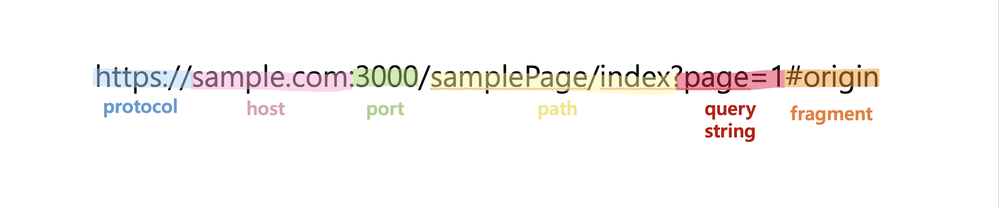

# CORS

Cross-Origin Resource Sharing 의 약자
resource sharing은 자원공유라는 의미로 해석이 되지만  
cross-origin 이라는 말은 의미가 와닿지 않는다.

---

### origin

우선 origin 이라는 단어의 뜻을 먼저 알아보자.
origin은 URL의 구조를 의미한다.
URL은 아래와 같은 구조를 가지고 있다.
  
여기서 origin은 protocol + host + port 이다.  
F12 를 눌러 console 에 window.origin 을 찍어보면 확인 할 수 있다.  
port 는 생략이 가능하다. 그래서 protocol + host 와 같은 형태가 나온다.

---

### cross-origin

본론으로 돌아와서 origin을 알아봤으니 cross-orign 이라는 말 뜻을 자세히 알아보자.
단어적 의미는 교차 origin(?) 뭔가 서로 다른 origin 의미 같다.
